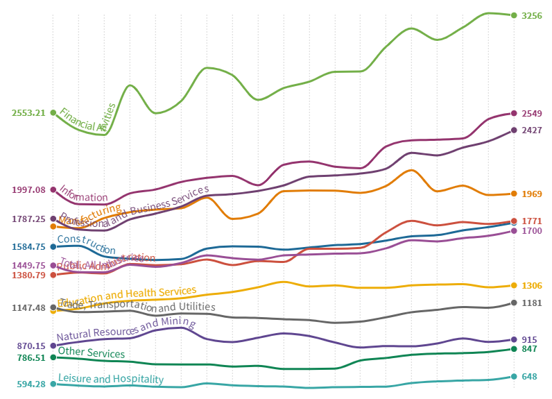

# Job Growth by Sector

#### Overall job growth, 2010 to 2019: <mark style="background-color:blue;">300,000 jobs (18%)</mark> &#x20;

#### Overall job growth, 2018 to 2019: <mark style="background-color:blue;">jobs (1.7%)</mark> &#x20;

#### Growing sectors, 2010 to 2019:  

* Construction: 56% &#x20;
* Professional and Business Services: 35% &#x20;
* Leisure and Hospitality: 28% &#x20;
* Education and Health Services: 21% &#x20;
* Information: 11%  &#x20;
* Trade, Transportation, and Utilities: 6% &#x20;
* Financial Activities: 5% &#x20;
* Other Services: 1% &#x20;

#### Declining sectors: &#x20;

* Manufacturing -4% &#x20;
* Public Administration -6% &#x20;



MetroCommon envisions a Metro Boston with a strong, diverse, and steadily growing economy, one in which the region has a thriving business ecosystem spanning from locally owned stores to global companies. In this envisioned future, medical, education, and high-tech sectors continue to play an important role in our economy, run by a strong supply of workers supported by our education system and workforce development programs.  &#x20;

The MAPC region added 320,000 jobs between 2010 and 2019, for 18 percent growth. Job growth in the region since 2001 has been principally driven by three sectors. Education and Health Services, the region’s largest industry, with 559,800 jobs in 2019, grew 21% between 2010 and 2019, and is the only industry in the region that had uninterrupted growth through the Great Recession in 2009. Professional and Business Services, the region’s second largest industry with 437,500 jobs grew over 35% over the same period. Combined with Leisure and Hospitality Services, the fourth largest industry with 218,600 jobs in 2019 and 28 percent growth, these three sectors alone added more than 80 percent of new jobs from 2010 to 2019.&#x20;

Other industries, including Finance, Public Administration, and Trade, Transportation, and Utilities have stagnated, with anemic growth or slight losses since 2010. The Information sector, encompassing much of the tech industry, has grown since 2010, but has not yet made up for the steep losses of the 2001 recession. Manufacturing has continued to see steady declines since 2010, though slower than the steep losses of the previous decade. &#x20;

These sector trends over the last decade show a region with a growing economy, but one that is increasingly driven by high-wage knowledge economies and the lower-wage industries that support them, exacerbating already wide income disparities. The dominance of the Education and Health Services sector for the last two decades has brought stability and prosperity to the region’s economy, but will it last? The pressure of ballooning student debt \[link to driving forces] and the uncertainty of federal changes to health care policy \[driving forces] suggest that changes could be in store in the coming decades. Industry leaders and policy makers would be wise to recognize and get ahead of these potential shifts, while also building the workforce development infrastructure needed to prepare the region’s next generation of workers. &#x20;

MetroCommon Goal: Goal H: Greater Boston’s economy benefits all in the region. &#x20;

MetroCommon Recommendations: Improve the accessibility and efficacy of the Commonwealth’s workforce development infrastructure, Actions 2.1, 2.2, 3.1&#x20;
