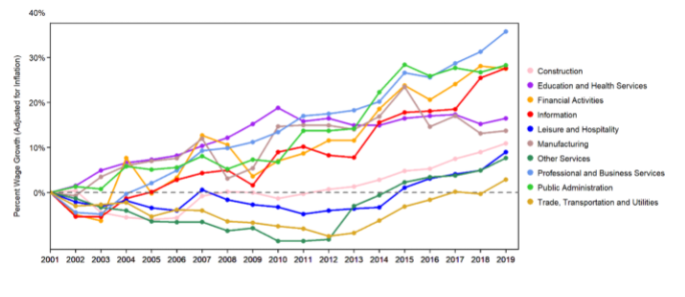

# 💰 Wage Growth by Sector

#### Overall wage growth: 12%, 2010 to 2019&#x20;

> Growing wage sectors, 2010-2019:   &#x20;

* Other Services: 21% &#x20;
* Public Administration: 20%
* Professional and Business Services: 20% &#x20;
* Financial Activities: 19% &#x20;
* Information: 17% &#x20;
* Leisure and Hospitality: 13% &#x20;
* Construction: 12% &#x20;
* Trade, Transportation, and Utilities: 11% &#x20;

> Declining wage sectors, 2010-2019:  &#x20;

* Education and Health Services: -2%
* Natural Resources and Mining: -5% &#x20;



The benefits of strong job growth are best realized when all the workers who want to participate in the economy can find opportunities to do so and are compensated fairly. Broadly speaking, average real wages have increased for most workers in the region over the last decade. Several industries that had experienced stagnant or declining wages in the previous decade (2001-2010), including Leisure and Hospitality, Other Services, and Trade, Transportation and Utilities saw a rebound of real wages from 2010 to 2019. Despite these gains, the trend of bimodal wage growth that began in decades prior persisted. &#x20;

Wages rebounded 11 to 13 percent in low-wage industries (Trade, Transportation and Utilities, Leisure and Hospitality, Construction), but they grew faster in high-wage sectors (19 percent in Financial Activities and 20 percent in Professional and Business Services), which means that existing wage disparities and income inequality in the region has remained, if not worsened. The Education and Health sector—the largest (and still growing) sector in the region—provided solidly middle wages (on average) to workers for the last two decades. However, since 2010 average real wages in the industry declined by 2 percent, presenting more signs of a declining middle class in the region that will be hard to rebuild without significant reform.&#x20;

While wages aren’t everything (benefits, predictability, gig work, and safety matter as well) raising wages across jobs in lower-paying industries is essential to closing income disparities. Some of the gains in lower-wage sectors such as leisure and hospitality is likely a result of legislation in 2015 and again in 2019 to incrementally raise the Massachusetts minimum wage from $8 in 2015 to $15 in 2023. Further legislation such as this is needed to provide the support lower-wage workers need to keep up with the rapidly rising wages of higher-wage industries. Equally important are efforts to balance the relative burden of wage disparity through taxation and benefit restructuring. &#x20;

MetroCommon Goals: Goal G.1,4: Economic Security &#x20;

MetroCommon Recommendations: Enable Wealth Creation and Intergenerational Wealth Transfer, Action 3.1, 3.2&#x20;
